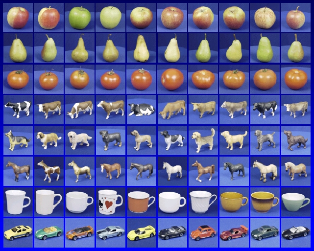
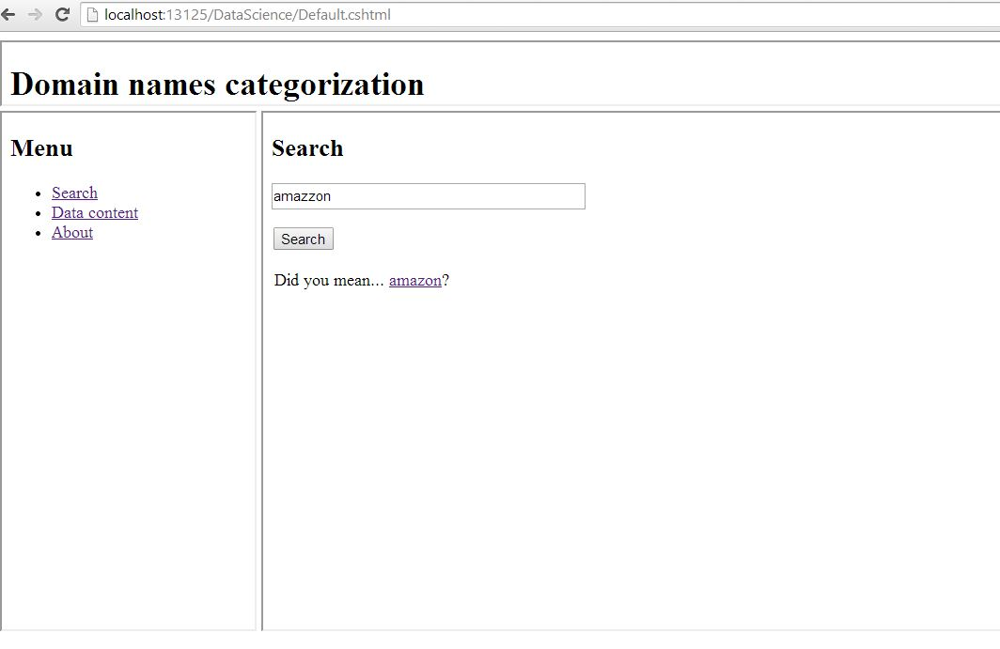
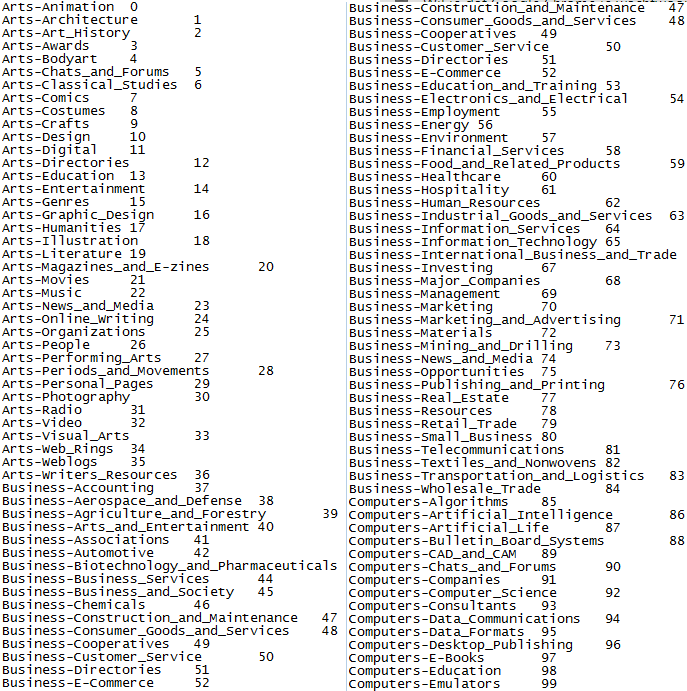

#Endreport for NorvigAward competition

<l><I> Source: http://www.newrafael.com/cultural-categories/ </I>

## 

- <b>Team:</b> Naward12 (on Github)
- <b>Subject:</b> Categorization of common web crawl
- <b>Course:</b> Datascience (TU Delft) IN4144

## Table of contents:

1. [Introduction to the idea](1#-introduction to the idea)
2. [Methodology towards performing experiments](2#-methodology towards performing experiments)
3. [Describement of the results](3#-describement of the results)
4. [Interpeation of the results](4#-interpeation of the results)
5. [Classification into different categories](5#-classification into different categories)
6. [Visualization of the data towards valuable insights into Big Data](6#-visualization of the data towards valuable insights into Big Data)
 
   
 <b>        
As part of the norvigaward competition we participate in this competition, as three master students from Delft University of technology, in order to get more experience into data science, and particular into a better understanding of the content that is present into the different websites which are characterized by their domain name. The general goal of the competition is to show what can be done with a 3 billion web page common crawl dataset which is made available for the competition. </b>
Background as basis for the idea to be started with this project has its origin into search engines providing lists of URL’s which could be presumed to be deduced from the web as a result of web related queries. This list contains indeed links to websites which have that information. However there is a difference between getting a list of URL’s which probably will contain that short of information that can be assigned to the given queries but without the initial specific text. There ,an end-user need to analyze the URL’s first to possibly find the information he or she initially demand for by typing in a set of queries. With the solution which is proposed, the end-users will have a search engine which can refine their search results further in case that a lot of content on a specific URL appears for instance, but need to be analyzed in a short amount of time to be able to either dismiss or accept a URL, which was proposed by a search engine. In this way users can refine their results further and gain more specific results towards desired information in less time. The big advantage is that content can be analyzed with more depth and used to decide whether or not a website is interesting for an end-user to use or not. That usage can be seen from different perspectives according to the different kind of information that can be assigned to a website for example, personal interests, hobbies, academic or business.
 
Secondly the insight into the web content is also applicable in case of looking for more information into specific end-users interests within websites’ borders, usually concerning websites that contain big amounts of information in general but user-specific interest must be deduced from it in short amount of processing time. When end-users have the desire to gain more specific information into a specific interest and using then common web crawl as 
the data source, this is also functional. For instance typing in a domain and getting visual graphs about the content of a 
website will also help to improve websites due to the ability to compare the composition of the websites with each other, and taking into account the specific public interest for those websites in order to target groups more detailed for advertising campaigns.
 
## 1. Introduction to the idea
The idea is to derive all relevant textual data from the common web crawl in order to classify it into different categories to make different domains more visible for each category as they can be assigned towards different categories. The idea started due to the demand of gaining more insight into the data that can be reached through the common web crawl. This categorization idea can lead to a more useful amount of selected data to, for example, adopt data mining or machine-learning activities with help of that categorized data. But also for websites to express their intentions better towards different search engines.  The idea is to make it possible to gain insight into a URL by typing the domain name into the search engine which makes it possible to gain insight into a specific domain name. That insight is strengthened by providing visual representations in form of  <i>Scalable Vector Graphics</i>. These graphs will who the end-user how content on the website is categorized and therefore applicable for specific purposes. 

Below you'll find an example table including values for different domains that can be assigned to different categories, wich are given below the columns as is staded in the figure below. The format is the same as the table which was given earlier in this report. Only now a sample picture is shown from the actual datacontent, as it will be shown on the aplication interface for the NorvigAwar competion.

Figure 1. Case of wrong entrance of domainname, appearance of corrective name

Figure 2. Appearance of descriptive statitiscs concerning calssification of the domain

Figure 3. Table with probability values according to classification of the common web crawl

## 2. Methodology towards performing experiments
A possible method is to first verify categories that are initially provided by a common brainstorm session between the teammembers. Afterwards the different words that can be assigned to each of the categories can be measured by count. 
So this is about synonyms that can be interpreted as common. of course the count of unique words is also incorporated to be able to specify each category more according to the different meaning of those words.  For getting a list of meaningful and therefore valuable amount of classifications there will be made use of <a href="https://www.dmoz.org">this website</a>. This website is one of the largest comprehensive human-edited directory of the Word Wide Web. Moreover, it is historically called the Open Directory Project (ODP). This site is presumed to be de most widely distributed data base of content that is classified by humans. 
In order to produce a machine-learning based classifier. The directory of this website is used in order to make the classifier as complete as possible. The website is therefore presumed to be a good approximation of all the content that is currently available on the web per domain. From every URL, the domain name will be deduced and consequently assigned to one or more categories in terms of probability chance that a given domain name, which is deduced from a URL, can be assigned to the categories. For Example a record will therefore be presented as follows:
 
 <body>   
<table>
      <tr>
         <th>URL</th>
         <th>First Category</th>
         <th>Second category</th>
         <th>Third Category</th>
         <th>Fourth Category</th>
      </tr>
 
       <tr>
        <td>www.amazon.com</td>
        <td>20</td>
        <td>40</td>
        <td>20</td>
         <td>20</td>
       </tr>
              
</table>
     
       
## 3. Describement of the results
This section will emphasize on the results that can be expected from this project. First of all the Common crawl dataset is indeed the main source concerning the data that is analyzed in order to classify it. However the classification is done with help of another <a href=http://www.dmoz.org> source </a>. This website has been used to classify the content from the common crawl dataset. This implicates that the results are strongly dependent on the quality of that website. This means that the quality of the classification concerning the common crawl dataset is strongly dependent on the quality of the website. The better the classification on the website is done, the better the classifier is, and the better the classification of the content can be completed. Machine-learning has been used to produce the classifier. All categories are assigned according to the words on a specific website. So this means that different websites with various content is classified on that website. And therefore the website can provide the possibility to machine-learning and as a result of this, a suitable classifier. 
 
 
## 4. Interpeation of the results
The interpretations of the results of the categorization is strongly dependent on the scalability of the retrieved categories with words. Therefore this section is filled whenever the results are interpreted. The visual representation, according to a given domain name is representational for the results that can be gained from the common crawl dataset. The visual graphing will show visual representations in order to interpret the results in a way which is representational for all of the different domains that are classified according to the classifier which is defined with help of a website which already contains different classifications. The visual graphs provide an overview on the classification of the content and therefore the chance of which the content of a given domain can be assigned to different amounts of categories. The results must be interpreted from the perspective of a general understanding of the content which is stated onto the different websites, in form of a categorization.
 
## 5. Classification into different categories
There are many categories possible to be used, in order to classify the content from the data in the common web crawl. These categories are adopted from dmoz.com as mentined earlier in paragraph 3. Below is presented several categories which are defined from the brainstorm between teammembers for the validation of the categories as presented in figure5.
World news, Food, Cars, Religion, Psychology, Sociology, Cooking, sports, education, science-fiction, literature, science, Electronics engineering, Civil engineering, computer science, Industrial design, Architecture, IT, Web shops, forum, Social Media, Maritime technology, sustainability,  entertainment, career opportunities, motorcycles, fashion, medicine treatment, government information, archeology, clothing and many more...

*adoption of categorization to the common web crawl: below you find a list with the first 100 categories that are gained from the website www.dmoz.com and that are ues in order to classify the data that is gained from the common webcrawl to gain more insight in the data content. This is used to gain insight into the webpage content per domain, but also to get an overall insight into the total content of web by gaining data from the common web crawl*

Figure 5: example list of first 100 categories used for categorization of data on webpages
 
## 6. Visualization of the data towards valuable insights into Big Data 
Influence/popularity of category on the web. Pie diagram which can show what kind of category contains the most textual data. Specification of a category. Tables with the frequency of different unique founded words for each category (that also is part of the web crawl). Similarity or overlapping of different categories with each other. By comparing the results of founded words from the same websites but assigned to different categories (why is that text together?).
Which websites contain most different meaningful words, and which one the fewest? Producing a Pie diagram as well with showing this interesting observation.
